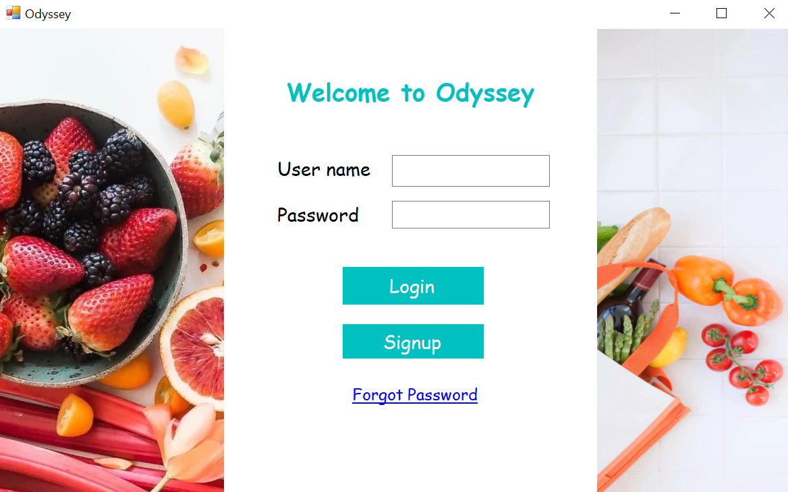
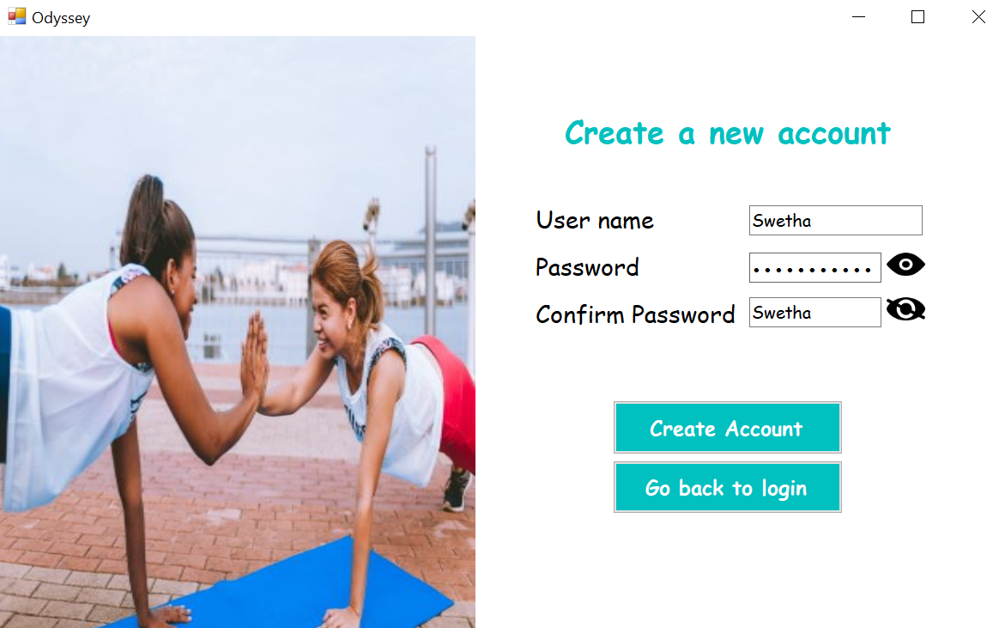

# FitnessTracker2.0
- UI improved. :pizza: :banana: :watermelon: :broccoli: :hamburger: 
- This is a mini project for implementing initial features of a good fitness application.
- This is the themified version of the other dbms fitness tracker avl in another repository. :bicyclist: :soccer: :runner:
- *Team of 5 for sem 4 DBMS.*

***

## Looks like this
>
>
>
> ___
>
>
>

***

#### To help stay fit. :grapes: :strawberry: :baseball: :volleyball:

- This is currently deployable on windows onlyy.
- This project especially in the form of an Android app on your phone could help track your movement n activity as well as nutrition in your diet.

